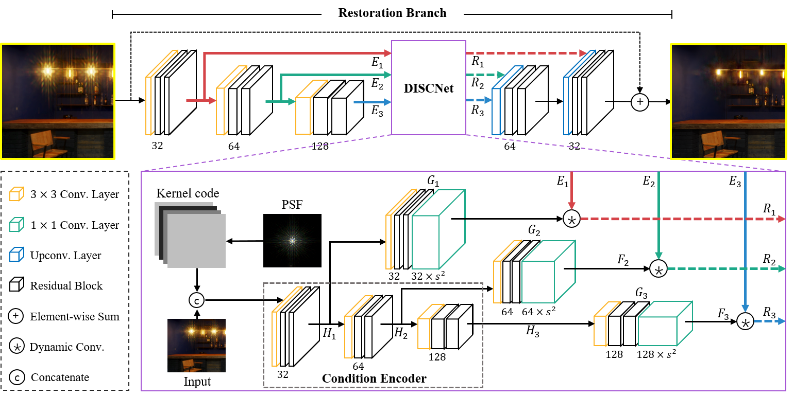

# DISCNet 


This repository contains the implementation of the following paper:
> **Removing Diffraction Image Artifacts in Under-Display Camera via
        Dynamic Skip Connection Network**<br>
> Ruicheng Feng, Chongyi Li, Huaijin Chen, Shuai Li, Chen Change Loy, Jinwei Gu<br>
> Computer Vision and Pattern Recognition (**CVPR**), 2021<br>

[[Paper](https://jnjaby.github.io/projects/UDC/src/03719.pdf)] [[Supplementary](https://jnjaby.github.io/projects/UDC/src/03719-supp.pdf)] [[Project Page](https://jnjaby.github.io/projects/UDC/)]




**Overview of our proposed DISCNet.** The main restoration branch consists of an encoder and a decoder, with feature maps propagated and transformed by DISCNet through skip connections. DISCNet applies multi-scale dynamic convolutions using generated filters conditioned on PSF kernel code and spatial information from input images.


**Figure**:
Removing *Diffraction* artifacts from Under-Display Camera (*UDC*) images using the proposed *DISCNet*. The major degradations caused by light diffraction are a combination of *flare*, *blur*, and *haze*. 


## Dependencies and Installation

- Python >= 3.7 (Recommend to use [Anaconda](https://www.anaconda.com/download/#linux) or [Miniconda](https://docs.conda.io/en/latest/miniconda.html))
- [PyTorch >= 1.3](https://pytorch.org/)
- NVIDIA GPU + [CUDA](https://developer.nvidia.com/cuda-downloads)

1. Clone repo

   ```bash
   git clone https://github.com/jnjaby/DISCNet.git
   ```

1. Install Dependencies

   ```bash
   cd DISCNet
   pip install -r requirements.txt
   ```

1. Install BasicSR

   Compile BasicSR without cuda extensions for DCN (Remember to modify the CUDA paths in `make.sh` and make sure that your GCC version: gcc >= 5) <br>

    ```bash
    sh ./make.sh
    ```


## Dataset Preparation

You can use the provided download script. The script considerably ruduce your workload by automatically downloading all the requested files, retrying each file on error, and unzip files.

Alternatively, you can also grab the data directly from [GoogleDrive](https://drive.google.com/drive/folders/13dZxX_9CI6CeS4zKd2SWGeT-7awhgaJF?usp=sharing), unzip and put them into `./datasets`.

Please refer to **[Datasets.md](datasets/README.md)** for pre-processing and more details.


## Get Started

### Test

We provide quick test code with the pretrained model. The testing command assumes using single GPU testing. Please see **[TrainTest.md](docs/TrainTest.md)** if you prefer using `slurm`.

1. Download pretrained models from Google Drive.

    ```bash
    python scripts/download_pretrained_models.py --method=DISCNet
    ```

1. Modify the paths to dataset and pretrained model in the following yaml files for configuration.

    ```bash
    ./options/test/DISCNet_test_synthetic_data.yml
    ./options/test/DISCNet_test_real_data.yml
    ```

1. Run test code for **synthetic** data.

    ```bash
    python -u basicsr/test.py -opt "options/test/DISCNet_test_synthetic_data.yml" --launcher="none"
    ```

   Check out the results in `./results`.

1. Run test code for **real** data.

   Feed the real data to the pre-trained network. 

    ```bash
    python -u basicsr/test.py -opt "options/test/DISCNet_test_real_data.yml" --launcher="none"
    ```

   The results are in `./results` (Pre-ISP versions, saved as `.png` and `.npy`.)
   
   (*Optional*) If you wish to further improve the visual quality, apply the post-processing pipeline.

    ```bash
    cd datasets
    python data_scripts/post_process.py \
    --data_path="../results/DISCNet_test_real_data/visualization/ZTE_real_rot_5" \
    --ref_path="datasets/real_data" \
    --save_path="../results/post_images"
    ```

### Train

All logging files in the training process, *e.g.*, log message, checkpoints, and snapshots, will be saved to `./experiments` and `./tb_logger` directory.

1. Prepare datasets. Please refer to `Dataset Preparation`.

1. Modify config files.

   ```bash
   ./options/train/DISCNet_train.yml
   ```

1. Run training code (*Slurm Training*). Kindly checkout **[TrainTest.md](docs/TrainTest.md)** and use single GPU training, distributed training, or slurm training as per your preference.

   ```bash
   srun -p [partition] --mpi=pmi2 --job-name=DISCNet --gres=gpu:2 --ntasks=2 --ntasks-per-node=2 --cpus-per-task=2 --kill-on-bad-exit=1 \
   python -u basicsr/train.py -opt "options/train/DISCNet_train.yml" --launcher="slurm"
   ```

## Results


Result on *synthetic* dataset.


Result on *real* dataset.


## Citataion

   If you find our repo useful for your research, please consider citing our paper:

   ```bibtex
   @inproceedings{feng2021removing,
      author = {Feng, Ruicheng and Li, Chongyi and Chen, Huaijin and Li, Shuai and Loy, Chen Change and Gu, Jinwei},
      title = {Removing Diffraction Image Artifacts in Under-Display Camera via Dynamic Skip Connection Networks},
      booktitle = {IEEE Conference on Computer Vision and Pattern Recognition (CVPR)},
      year = {2021}
   }
   ```


## License and Acknowledgement

This project is open sourced under MIT license. The code framework is mainly modified from [BasicSR](https://github.com/xinntao/BasicSR). Please refer to the original repo for more usage and documents.


## Contact

If you have any question, please feel free to contact us via `ruicheng002@ntu.edu.sg`.
